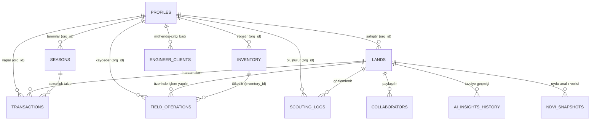

# ORJUT AGTECH OS — VERİTABANI REFERANSI (DATABASE REFERENCE)

Orjut veritabanı, Supabase barındırmalı PostgreSQL üzerinde yapılandırılmış olup, katı bir ilişkisel modele (Relational Model) ve Satır Düzeyinde Güvenlik (Row Level Security - RLS) kurallarına sahiptir.

---

## 1. ER DİYAGRAMI (VARLIK İLİŞKİ ŞEMASI)

---

## 2. ANA TABLOLAR VE SÖZLÜK

* **`profiles`:** (id, phone, first_name, last_name, role, is_premium, payment_status). Supabase Auth trigger'ı ile otomatik oluşur. Temel kullanıcı tablosudur. Rol bazlı (`farmer`, `engineer`, `admin`) yetkilendirmeleri tutar.
* **`lands`:** (id, org_id, boundaries, crop_type, size_decare, lat, lng vb.). Tarlaları tanımlar. `boundaries` kolonu haritada çizilen koordinatları `GeoJSON` (JSONB) olarak saklar. `org_id` üzerinden profiles'a bağlıdır.
* **`transactions`:** (id, org_id, land_id, type, amount, category). Gelir ve gider (expense/income) hareketlerini tutar. Finansal ana defterdir.
* **`inventory`:** (id, org_id, item_name, quantity, type, unit_cost). Depodaki tohum, gübre ve yakıt stoklarını tutar.
* **`field_operations`:** (id, org_id, land_id, inventory_id, type, amount). Tarlaya yapılan sulama, gübreleme, ilaçlama işlemlerinin operasyonel kayıtlarını tutar.
* **`scouting_logs`:** (id, org_id, land_id, health_status, prescription_notes). Ziraat mühendislerinin veya çiftçinin arazide yaptığı gözlemleri ve verilen **zirai reçeteleri** barındırır.
* **`engineer_clients`:** (id, engineer_id, farmer_id, status). Hangi çiftçinin hangi ziraat mühendisine bağlı olduğunu tutar (Çapraz tablo/Relation table).

---

## 3. FONKSİYONLAR (RPC) VE TRİGGER'LAR

### A. Otomatik Kullanıcı Oluşturma (Trigger)
Supabase Auth servisine yeni bir kullanıcı kaydolduğu zaman, PostgREST API veritabanına bir kayıt atar. Bunu dinleyen `handle_new_user` PostgreSQL trigger'ı, bu id ile `profiles` tablosunda yeni bir satır oluşturur ve rolü varsayılan olarak `farmer` atar.

### B. `apply_expense_atomic` (RPC İşlevi)
Atomik (tek işlem bloğu içerisinde ya hepsi tamamlanır ya da hiçbiri) bir veri yordamıdır.
Bir gider faturası depoya ekleneceği zaman bu fonksiyon çağrılır:
1. `transactions` tablosuna gider miktarı, tarihi ve açıklaması yazılır.
2. `inventory` tablosundaki o ürünün id'si bulunup `quantity` değeri güncellenerek artırılır.
İşlem başarısız olursa veritabanı rollback (geri sarma) yaparak veri tutarsızlığını engeller.

---

## 4. ROW LEVEL SECURITY (RLS) POLİTİKALARI

Orjut veritabanında tüm tablolar RLS ile sıkı bir biçimde dış dünyaya kilitlenmiştir.
* Kural: Her tabloda `org_id::text = auth.uid()::text` koşulu aranır.
* Yani `lands` tablosuna istek atıldığında PostgreSQL otomatik olarak sorguyu filtreler ve sadece kullanıcının giriş token'ında yazılı olan UUID'ye sahip arazileri gönderir.
* **Admin Yetkisi:** Admin bypass yetkilerinde oluşan döngü (infinite recursion) problemleri nedeniyle kilitlenen giriş sorunları çözülmüş, yetki denetimi basit RLS seviyesine çekilmiştir.
