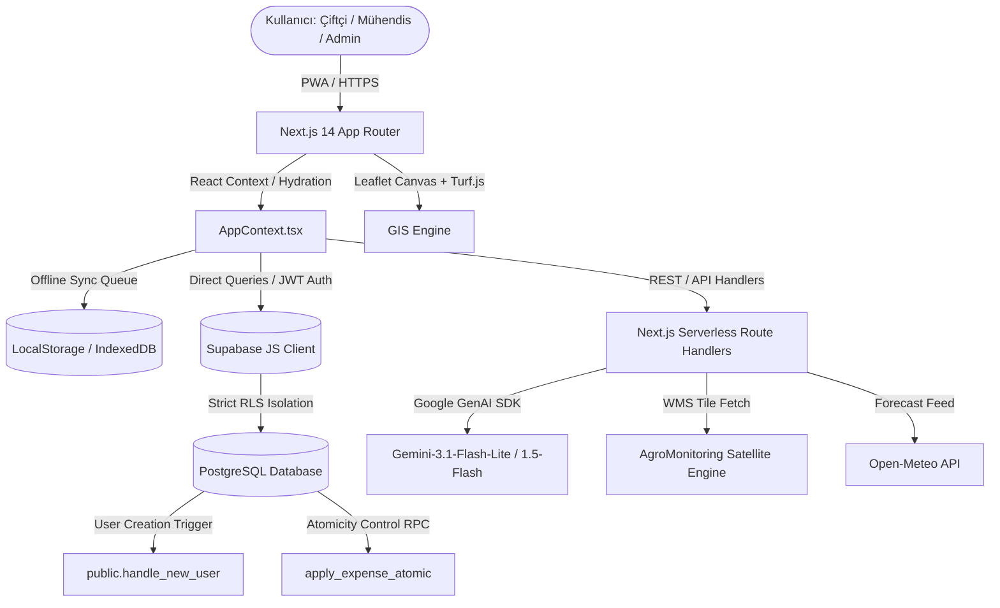
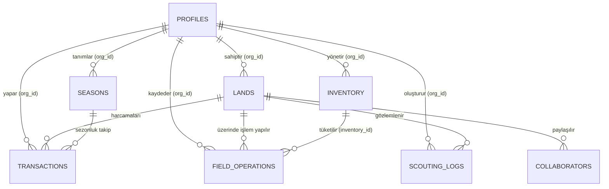

# ORJUT AGTECH OS — ULTRA ARCHITECTURE BLUEPRINT (360° TECHNICAL SPECIFICATION)

Bu belge, **Orjut AgTech OS** tarım işletim sisteminin tüm katmanlarını, veritabanı şemalarını, coğrafi bilgi sistemleri (CBS) motorunu, çevrimdışı durum (state) senkronizasyon mekanizmalarını ve yapay zeka RAG entegrasyonlarını kapsayan **en kapsamlı teknik mimari referans belgesidir**.

---

## 1. GENEL BAKIŞ VE TOPOLOJİ

Orjut, modern tarımsal işletme ihtiyaçlarını karşılamak üzere istemci tarafında Next.js 14 App Router, sunucu tarafında Supabase PostgreSQL veritabanı ve Supabase Auth sistemini birleştiren hibrit bir SaaS mimarisine sahiptir.



### Temel Teknoloji Yığını:
*   **İstemci (Client-Side):** Next.js 14.2.3 (App Router - Koyu Tema Cam Glassmorphism Tasarımı), React Context API (`AppContext`), Tailwind CSS, Lucide React.
*   **CBS ve Coğrafi Hesaplamalar:** Leaflet.js, React-Leaflet, Turf.js (Dekar/Metrekare alan hesaplayıcı, centroid tespiti).
*   **Çevrimdışı ve PWA Özellikleri:** Next-PWA, Service Workers (`sw.js`), Önbellek Yönetimi, LocalStorage Sync Kuyruğu.
*   **Veritabanı & Güvenlik:** Supabase PostgreSQL, Row Level Security (RLS) kuralları, PostgreSQL Triggers ve RPC'ler.
*   **AI & RAG Altyapısı:** Google GenAI SDK, `@google/generative-ai`, Gemini 1.5 Flash (Analiz/JSON Modu), Gemini 3.1 Flash Lite (Günlük özet tavsiyeleri).

---

## 2. KİMLİK DOĞRULAMA VE SATIR BAZLI GÜVENLİK (RLS)

Sistemde veri izolasyonu, `org_id` (Organizasyon / Kullanıcı Benzersiz Kimliği) baz alınarak veritabanı seviyesinde katı Row Level Security (RLS) politikalarıyla korunur.

### A. Otomatik Profil Eşleme ve Triggers
Kullanıcı kayıt olduğunda, Supabase Auth şemasında tetiklenen `handle_new_user()` PostgreSQL fonksiyonu, kullanıcıyı otomatik olarak `public.profiles` tablosuna aktarır:

```sql
CREATE OR REPLACE FUNCTION public.handle_new_user()
RETURNS trigger AS $$
BEGIN
  INSERT INTO public.profiles (id, phone, first_name, last_name, role, is_premium, payment_status)
  VALUES (
    new.id,
    new.phone,
    COALESCE(new.raw_user_meta_data->>'first_name', 'Çiftçi'),
    COALESCE(new.raw_user_meta_data->>'last_name', ''),
    'farmer', -- Yeni kullanıcılar varsayılan olarak farmer rolünü alır
    false,
    'free'
  );
  RETURN new;
END;
$$ LANGUAGE plpgsql SECURITY DEFINER;
```

### B. Admin Bypass Mimarisi ve Sonsuz Döngü (Recursion) Koruması
RLS politikalarında admin kullanıcıların tüm kayıtları görmesini sağlamak için performansı yüksek ve sonsuz döngü yaratmayan alt sorgu yapılandırması tercih edilmiştir. `profiles` tablosundaki kilitlenme riski şu şekilde çözülmüştür:
*   Standard kullanıcılar yalnızca `org_id = auth.uid()` koşulunu sağlayan satırları yönetebilir.
*   Admin yetkisine sahip kullanıcılar, RLS politikalarında tetiklenen `(SELECT role FROM public.profiles WHERE id = auth.uid()) = 'admin'` kontrolü ile veritabanı seviyesinde doğrudan bypass edilerek tüm organizasyon verilerine erişebilir.

### C. Client-Side Route Guards (`AuthGuard.tsx`)
Sayfa geçişleri tarayıcı tarafında `AuthGuard.tsx` aracılığıyla katı bir şekilde denetlenir:
1.  **Giriş Kontrolü:** Geçersiz oturumlarda `localStorage` tamamen temizlenir ve kullanıcı anında `/login` rotasına atılır.
2.  **Rol Yetkilendirme:** Farmer rolündeki bir kullanıcı `/admin` veya `/engineer` rotasına erişmeye çalıştığında, arayüz render edilmeden istek kesilir ve kullanıcı `/dashboard` sayfasına geri yönlendirilir.

---

## 3. HİBRİT FİNANS-ENVANTER KÖPRÜSÜ VE VERİ TABANI ŞEMASI

Veritabanı, finansal harcamalar ile envanter depoları arasında **atomik** geçişler sağlayan bir ilişkisel şema üzerine kuruludur.



### A. Depo Entegrasyonlu Atomik Masraf Akışı (Hybrid Flow RPC)
Çiftçi, `ExpenseModal` üzerinden "Envantere ekle" seçeneğiyle harcama girdiğinde sistem tutarlılığı garanti altına almak için `apply_expense_atomic` veritabanı RPC'sini tetikler. Bu işlem, gideri `transactions` tablosuna kaydederken depo stoğunu artırır.
Eğer harcanan ilaç veya gübre o an araziye uygulandıysa, stok miktarını düşüren bir `field_operations` satırı da aynı atomik işlem içinde kuyruklanır.

### B. İlişkisel Veri Sözlüğü

#### 1. `profiles` (Kullanıcı Tablosu)
*   `id`: UUID (Primary Key, Supabase Auth `auth.users.id` ile eşleşir).
*   `phone`: TEXT (Unique).
*   `first_name`: TEXT, `last_name`: TEXT.
*   `role`: TEXT (Constraint: `'farmer'`, `'engineer'`, `'admin'`).
*   `is_premium`: BOOLEAN (Default: `false`).
*   `payment_status`: TEXT (Constraint: `'free'`, `'pending_approval'`, `'approved'`).

#### 2. `lands` (Tarım Arazileri ve Seralar)
*   `id`: UUID (Primary Key).
*   `org_id`: UUID (FK -> `profiles.id`, `ON DELETE CASCADE`).
*   `boundaries`: JSONB (GeoJSON formatında çokgen verisi).
*   `city`: TEXT, `district`: TEXT, `neighborhood`: TEXT.
*   `block_no`: TEXT, `parcel_no`: TEXT.
*   `size_decare`: NUMERIC (Açık tarla dönüm büyüklüğü).
*   `size_sqm`: NUMERIC (Sera metrekare büyüklüğü).
*   `environment_type`: TEXT (Constraint: `'acik_tarla'`, `'sera'`).
*   `crop_type`: TEXT (Ekilmiş ürün türü).
*   `planting_date`: DATE (Ekim tarihi).
*   `is_irrigated`: BOOLEAN (Sulama sistemi aktif/pasif).
*   `soil_type`: TEXT (Killi, kumlu, tınlı toprak yapısı).
*   `lat`: DOUBLE PRECISION, `lng`: DOUBLE PRECISION (Arazinin merkez koordinatları).
*   `agromonitoring_polygon_id`: TEXT (Uydu takibi için harici poligon ID).

#### 3. `transactions` (Finansal Defter)
*   `id`: UUID (Primary Key).
*   `org_id`: UUID (FK -> `profiles.id`, `ON DELETE CASCADE`).
*   `land_id`: UUID (FK -> `lands.id`, `ON DELETE SET NULL`).
*   `season_id`: UUID (FK -> `seasons.id`, `ON DELETE SET NULL`).
*   `type`: transaction_type (`'expense'`, `'income'`).
*   `amount`: NUMERIC (Masraf veya gelir tutarı).
*   `category`: TEXT (Örn: "Gübreleme", "İlaçlama", "Yakıt", "Tohum").
*   `description`: TEXT (Açıklama).
*   `quantity`: NUMERIC, `unit`: TEXT (Örn: 50 Litre).
*   `date`: DATE (İşlem tarihi).

#### 4. `inventory` (Depo Stok Durumu)
*   `id`: UUID (Primary Key).
*   `org_id`: UUID (FK -> `profiles.id`, `ON DELETE CASCADE`).
*   `item_name`: TEXT (Stok kalemi adı).
*   `quantity`: NUMERIC (Stok miktarı).
*   `unit`: TEXT (Birim örn: "kg", "litre").
*   `unit_cost`: NUMERIC (Son alımın birim maliyeti).
*   `type`: inventory_type (`'seed'`, `'fertilizer'`, `'fuel'`, `'pesticide'`, `'other'`).
*   `last_purchase_date`: DATE.

#### 5. `scouting_logs` (Arazi Gözlemleri & Zirai Reçeteler)
*   `id`: UUID (Primary Key).
*   `org_id`: UUID (FK -> `profiles.id`, `ON DELETE CASCADE`).
*   `land_id`: UUID (FK -> `lands.id`, `ON DELETE CASCADE`).
*   `health_status`: TEXT (Constraint: `'saglikli'`, `'hastalik'`, `'zararli'`).
*   `growth_stage`: TEXT (Constraint: `'cimlenme'`, `'ciceklenme'`, `'hasat_onu'`).
*   `notes`: TEXT (Mühendis veya çiftçi gözlem notları).
*   `prescription_action`: TEXT (Zirai öneri başlığı).
*   `prescription_text`: TEXT (Farmer paneline düşecek nihai reçete metni).
*   `is_prescription_applied`: BOOLEAN (Default: `false`).

---

## 4. GELİŞMİŞ CBS (GIS) MOTORU VE AKILLI SIMÜLASYON KATMANLARI

Haritalandırma altyapısı `Leaflet.js` ve `Turf.js` ile güçlendirilmiştir. Sistem, uydu verisi bulunmayan tarlalar için dynamic simülasyon katmanları sunarak saha testlerinde kusursuz çalışır.

### A. Alan Sınırlamaları ve Geometri İşleme
*   Çizilen poligonların alan hesaplamaları Turf.js (`@turf/turf`) aracılığıyla istemci tarafında anlık olarak yapılır.
*   **Performans & Kota Koruması:** Sunucuya aşırı yük binmesini ve veritabanı yorulmalarını engellemek amacıyla **500 dekarı aşan** açık tarla çokgen çizimleri Leaflet `EditControl` tetikleyicisiyle bloke edilir.

### B. Akıllı Katman Yönetimi (Smart Layer Fallback / Simulation)
Eğer arazinin AgroMonitoring kaydı yoksa (`agromonitoring_polygon_id` eksik veya `'none'`), sistem haritayı kilitlemez veya hata vermez. Bunun yerine, ekin türünü, sulama durumunu (`is_irrigated`) ve hava tahmin istasyonu verilerini (`temperature`, `humidity`) okuyarak poligon alanını renklendiren **yerel bir sensör simülasyon katmanı** kurgular:

```typescript
// Dosya: src/components/LeafletMap.tsx

const getLandStyle = (land: any) => {
  if (activeLayer === 'normal') {
    return { fillColor: '#2e7d32', fillOpacity: 0.35, color: '#1b5e20', weight: 2 };
  }
  
  const hasPolygon = land?.agromonitoring_polygon_id && land?.agromonitoring_polygon_id !== 'none';
  if (hasPolygon) {
    // Gerçek AgroMonitoring uydu katmanı yükleneceği için vektör alan şeffaflaştırılır.
    return { fillColor: '#2e7d32', fillOpacity: 0.01, color: '#1b5e20', weight: 1 };
  }

  // UYDU EŞLEŞMESİ YOKSA: Konuma göre tutarlı simülasyon hesaplama
  const lat = parseFloat(land?.lat ?? '37.0');
  const lng = parseFloat(land?.lng ?? '35.0');
  const baseValue = Math.abs(Math.sin(lat * 1000 + lng * 1000) * 20); // Deterministik sapma
  
  if (activeLayer === 'ndvi') {
    // NDVI Bitki Sağlığı Simülasyonu (0.60 - 0.85)
    const ndvi = land?.is_irrigated ? 0.75 + (baseValue / 200) : 0.60 + (baseValue / 200);
    let fillColor = '#ff9800'; // Kritik Kuruluk
    if (ndvi > 0.8) fillColor = '#1b5e20';      // Mükemmel Bitki Sağlığı
    else if (ndvi > 0.7) fillColor = '#4caf50'; // Sağlıklı Ekin
    else if (ndvi > 0.6) fillColor = '#8bc34a'; // Kabul Edilebilir
    
    return { fillColor, fillOpacity: 0.6, color: '#2e7d32', weight: 1.5, dashArray: '3' };
  } else {
    // Toprak Nemi Simülasyonu (%35 - %75)
    const moisture = land?.is_irrigated ? 55 + baseValue : 35 + baseValue;
    let fillColor = '#ffc107'; // Kuru Toprak Stresi
    if (moisture > 65) fillColor = '#0d47a1';      // Aşırı Nemli
    else if (moisture > 50) fillColor = '#2196f3'; // İdeal Nem Oranı
    else if (moisture > 40) fillColor = '#00bcd4'; // Yeterli Nem
    
    return { fillColor, fillOpacity: 0.6, color: '#0284c7', weight: 1.5, dashArray: '3' };
  }
};
```

---

## 5. ÇEVRİMDIŞI ÇALIŞMA (OFFLINE-FIRST) VE PWA MİMARİSİ

Dağlık ve internetin kısıtlı olduğu arazilerde kesintimiz çalışma için platform **PWA** altyapısını kullanır.

### A. Durum Senkronizasyon ve Hydration Döngüsü
İstemci tarafında `AppContext.tsx` global veri yüklemesini yönetir:
1.  **Paralel Hydration:** Sayfa yüklendiğinde, `localStorage` içindeki `user_id` üzerinden araziler, işlemler, stoklar ve sezonlar `Promise.all` ile paralel şekilde Supabase'den çekilerek yükleme hızı optimize edilir.
2.  **Weather Cache (1 Saatlik Önbellek):** Open-Meteo API'sine yapılan mükerrer istekleri engellemek için konum bazlı hava durumu verileri tarayıcıda `weather_cache_{lat}_{lon}` anahtarıyla **1 saat** boyunca önbelleğe alınır.

### B. Offline Sync Queue (Çevrimdışı İşlem Kuyruğu)
İnternet bağlantısı koptuğunda:
*   Kullanıcı veri girmeye (Masraf ekleme, gözlem kaydetme vb.) devam edebilir.
*   Girilen veriler `pending_` ön eki ile `localStorage`'da kuyruğa alınır.
*   `NetworkStatus.tsx` tarayıcıda internet bağlantısının geri geldiğini algıladığı an, bu kuyrukta biriken istekleri arka planda sırasıyla Supabase veritabanına yazar ve yerel cache'i günceller.

---

## 6. YAPAY ZEKA PROAKTİF AGRONOMİST VE RAG PIPELINE

Orjut AI Motoru, tarlanın geçmişini, hava durumu koşullarını ve envanter durumunu tek bir bağlamda harmanlayan hibrit bir **RAG (Retrieval-Augmented Generation)** mimarisidir.

### A. RAG Ingestion & Minification Pipeline (Bağlam Sıkıştırma)
Gemini modellerine devasa GeoJSON koordinatları ve binlerce satırlık operasyon geçmişi göndermek hem token maliyetini artırır hem de gecikmeye (latency) sebep olur. Bu sebeple `ragEngine.ts` içinde **Phase 5 Minification** altyapısı uygulanmıştır:
1.  **Coordinate Truncation:** Poligonların uç nokta koordinatları virgülden sonra tam 6 basamakta kesilerek (örneğin `37.747812`) Gemini'a iletilir.
2.  **Token Limit Protection:** Arazi için sadece en son 3 zirai işlem, en son 15 gözlem raporu ve en son 20 harcama kaydı çekilir.
3.  **Recursive JSON Limiter (`limitContextSize`):** Hazırlanan RAG bağlam nesnesi (`LAND`, `CTX`, `CURR`) JSON formatına serialize edildikten sonra **15.000 karakterlik** üst sınırı aşıyorsa, RAG nesnesindeki dizilerden en eski elemanları pop eder ve uzun metinleri ortadan keserek bağlamı dinamik olarak 15k sınırının altına çeker.

### B. Proaktif Karar Mekanizması & Prompt Tasarımı
Yapay zeka asistanı sadece durumu analiz etmez, **proaktif kararlar** üretir. `aiActionEngine.ts` içindeki prompt şu kurallarla beslenir:
*   **Ekim Günü Kontrolü:** Ekim tarihinden bugüne geçen gün sayısını hesaplayarak bitkinin hangi gelişim evresinde (Örn: pamukta çiçeklenme dönemi) olduğunu tespit eder.
*   **Meteorolojik Koordinasyon:** "2 gün sonra şiddetli yağış geliyor, bu akşam sulamayı kesin, aksi takdirde kök çürümesi yaşanabilir" gibi proaktif uyarılar üretir.
*   **Kritik Don/Hastalık Alerjileri:** Eğer hava sıcaklığı 2°C'nin altına düşecekse veya nem %90'ın üzerine çıkıp mantar hastalığı riski doğuracaksa, JSON çıktısındaki `critical_alert` alanını anında tetikler.

---

## 7. SISTEM DIZIN HARITASI VE BILEŞEN ROLLERI

```
orjut/
├── public/
│   ├── sw.js                      # PWA Service Worker (Çevrimdışı Önbellek Yönetimi)
│   ├── manifest.json              # Mobil yükleme ve ikon tanımları
│   └── orjut_dashboard_mockup.png # Landing page dashboard arayüz görseli
├── supabase/                      # Yerel supabase yapılandırma dosyaları
├── src/
│   ├── app/                       # Next.js App Router Katmanı
│   │   ├── admin/                 # Admin Dashboard (Abone onayları, rol yönetimi)
│   │   ├── api/                   # Serverless Backend API'leri
│   │   │   ├── ai/
│   │   │   │   ├── analyze/       # Arazi bazlı derin yapay zeka analiz rotası
│   │   │   │   └── daily-insight/ # Günlük proaktif zirai tavsiye motoru
│   │   │   └── cron/              # Zamanlanmış görevler (NDVI çekme, raporlama)
│   │   ├── dashboard/             # Çiftçi Ana Arayüzü ve Alt Sayfaları
│   │   ├── en/                    # İngilizce dil yerelleştirme klasörü
│   │   ├── engineer/              # Mühendis Kontrol Paneli (Danışan ve Reçete yönetimi)
│   │   ├── invite/                # Mühendis davet kabul dinamik route yapısı
│   │   ├── legal/                 # PayTR & BDDK uyumlu yasal sözleşme sayfaları
│   │   ├── login/                 # Telefon/OAuth Giriş sayfası
│   │   └── globals.css            # CSS değişkenleri, Apple teması, neon efektler
│   ├── components/                # Modüler UI Bileşenleri
│   │   ├── lands/                 # Arazi ekleme formları ve listeleri
│   │   ├── ui/                    # Premium Modallar (Upsell, BaseModal, Button)
│   │   ├── AuthGuard.tsx          # Oturum ve Rol Tabanlı İleri Düzey Güvenlik Muhafızı
│   │   └── LeafletMap.tsx         # GIS Altyapısı, EditControl ve WMS NDVI Katmanı
│   ├── context/
│   │   └── AppContext.tsx         # Global React Eyalet Yönetimi, Hydration ve Offline sync
│   ├── hooks/                     # Custom React Kancaları
│   ├── lib/                       # Yardımcı Kütüphaneler ve Servisler
│   │   ├── aiActionEngine.ts      # Yapay zeka prompt yapılandırıcısı
│   │   ├── db.ts                  # Supabase Birleşik Veri Erişim Nesnesi (DAO)
│   │   ├── notifications.ts       # Web Push bildirim motoru
│   │   ├── ragEngine.ts           # RAG Bağlam Sıkıştırıcısı ve Token Koruyucu
│   │   ├── weatherService.ts      # Open-Meteo koordinat entegratörü ve Cache altyapısı
│   │   └── schemas/               # Zod doğrulama şemaları (landSchema vb.)
│   └── types/                     # Global TypeScript Tip Tanımlamaları
└── schema.sql                     # Veritabanı ana şeması ve migration geçmişleri
```

---

## 8. KURULUM VE DEV AYAKLANDIRMA REHBERİ

### Geliştiriciler İçin Hızlı Ayaklandırma Adımları:
1.  **Ortam Değişkenleri:** `.env.local` dosyası oluşturularak `NEXT_PUBLIC_SUPABASE_URL`, `NEXT_PUBLIC_SUPABASE_ANON_KEY` ve `GEMINI_API_KEY` değişkenleri girilmelidir.
2.  **Veritabanı Kurulumu:** Supabase SQL Editor paneli üzerinde sırasıyla `schema.sql` ve RLS düzeltmelerini içeren şema kodları çalıştırılmalıdır.
3.  **Local Dev Sunucu:** `npm install` ve `npm run dev` komutlarıyla geliştirici sunucusu `http://localhost:3000` portunda ayağa kaldırılabilir.
4.  **Tesisat Doğrulaması:** Yeni bir tarım arazisi çizip kaydedin, depo stoğu ekleyip ekin sulama operasyonu girin ve AI Günlük Analiz asistanının bu verileri anında okuyarak analiz ürettiğini doğrulayın.

---
**Sürüm:** 2.0.0 (Enterprise Production Ready)  
**Son Teknik Kontrol:** 18 Mayıs 2026  
**Oluşturan:** Chief System Reverse Architect  
**,Description:
