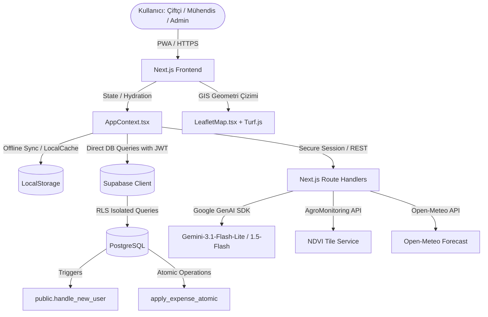
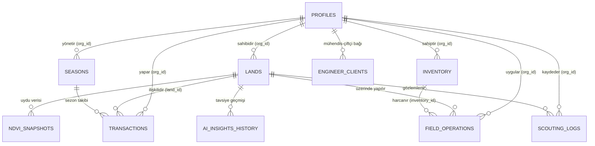

# ORJUT AGTECH OS — ULTRA MASTER CONTEXT
> **SÜRÜM:** 2.0 (ENTERPRISE PRODUCTION FINAL)  
> **GÜNCELLEME TARİHİ:** 17 Mayıs 2026  
> **DURUM:** CANLI YAYINA HAZIR (PRODUCTION READY)  
> **ROL:** Chief System Reverse Architect Raporu  

Bu doküman, Orjut AgTech OS platformunun tüm kaynak kodlarının, veritabanı yapılarının, yapay zeka mimarisinin, güvenlik önlemlerinin ve iş kurallarının tersine mühendislik ile çıkarılmış **tek nihai gerçeğidir (Single Source of Truth)**. Başka bir AI modelinin veya kıdemli yazılım mühendisinin projeyi sıfır bilgi ve bağlam kaybıyla devralabilmesi amacıyla maksimum teknik derinlikte hazırlanmıştır.

---

## 1. PROJECT IDENTITY

*   **Proje Adı:** Orjut (ZiraiAsistan olarak da konumlandırılmıştır)
*   **Ana Amaç:** Çiftçilerin arazi sınırlarını, toprak özelliklerini, zirai operasyonlarını (sulama, gübreleme, ilaçlama), envanterlerini ve finansal işlemlerini tek bir merkezden yönetmesini sağlayan, coğrafi bilgi sistemleri (CBS) ve yapay zeka (AI) destekli yeni nesil tarım işletim sistemidir.
*   **Çözmeye Çalıştığı Problem:** 
    *   Tarım arazilerinde ekin gelişiminin uydudan takipsizliği ve hastalıkların erken teşhis edilememesi.
    *   Harcamaların (gübre, mazot, ilaç) hangi araziye ve hangi sezona ait olduğunun takip edilememesi nedeniyle net karlılık analizinin yapılamaması.
    *   Ziraat mühendisleri ile çiftçiler arasındaki iletişimin kopuk olması, reçetelerin kaybolması.
    *   Hava durumu tahminleri ile sulama/ilaçlama operasyonlarının koordine edilememesi sonucu kaynak israfı.
*   **Hedef Sektör:** Tarım Teknolojileri (AgTech), B2B SaaS.
*   **Hedef Kullanıcı Tipi & Personalar:**
    *   **Çiftçi (Farmer):** Arazilerini haritada çizen, günlük giderlerini ve operasyonlarını giren, yapay zekadan hava koşullarına göre günlük eylem planı alan ana kullanıcı.
    *   **Ziraat Mühendisi (Engineer):** Çiftçilerin arazilerini gözlemleyen, bitki sağlığı skorlayan ve doğrudan çiftçinin paneline düşen zirai reçeteler/tavsiyeler yazan uzman agronomist.
    *   **Sistem Yöneticisi (Admin):** Sistem metriklerini izleyen, kullanıcıların rollerini değiştiren ve manuel/havale ile yapılan "Hasat Pro" ödemelerini onaylayan platform sahibi.
*   **İş Modeli:** Freemium & B2B SaaS Abonelik Modeli.
*   **Paket Yapısı:**
    *   **Ücretsiz Başlangıç (Free Tier):** En fazla 3 arazi, toplamda maksimum 100 dekar (dönüm) arazi sınır takibi, temel finans ve stok takibi.
    *   **Hasat Pro (Premium Tier):** Aylık 499 ₺ veya Yıllık 4.990 ₺ (2 Ay Hediye). Sınırsız arazi ekleme (maksimum 5000 dekar), Proaktif AI Zirai Danışman, NDVI Uydu Sağlık Isı Haritaları, Toprak Nemi Katmanları ve Gelişmiş Raporlama.
*   **Ölçeklenme Limiti:** 5.000 Dekar üzeri araziler için platform B2B Kurumsal Fiyatlandırma/Özel Altyapı modeline geçiş yapar.
*   **Değer Önerisi:** Entegrasyon karmaşasından uzak, uydudan NDVI analizlerini ve yapay zeka agronomisini tek arayüzde birleştiren, çevrimdışı çalışabilen (PWA) Apple esintili premium tasarıma sahip ilk yerli AgTech OS.
*   **Rakiplerden Farkı:** Karmaşık GIS araçlarının aksine, kullanıcıyı teknik detaylara boğmayan "İlerici Açıklama" (Progressive Disclosure) felsefesiyle tasarlanmış arayüz ve yapay zekanın ham veriyi doğrudan eylem planına dönüştürmesi.

---

## 2. FULL SYSTEM OVERVIEW

Orjut, istemci tarafında Next.js 14 App Router mimarisi ve React Context API üzerinde çalışırken, veri ve güvenlik katmanında Supabase (PostgreSQL) ve Supabase Auth servislerini kullanır.



### Uçtan Uca Veri Akışı ve Çalışma Mantığı:
1.  **Hydration (Yükleme & Eşitleme):** Uygulama açıldığında `AuthGuard.tsx` kullanıcının oturumunu doğrular. Online ise Supabase Auth oturumu ile `profiles` tablosunu sorgular. `AppContext.tsx` tetiklenerek `localStorage`'daki `user_id` üzerinden araziler, işlemler, stoklar ve finansal kayıtlar paralel olarak veritabanından çekilip React state'ine hidrat edilir.
2.  **Geospatial CBS Akışı:** Çiftçi harita üzerinde `LeafletMap.tsx` aracılığıyla sınırlarını çizer. Çizilen poligon `Turf.js` ile analiz edilerek dekar büyüklüğü hesaplanır. Poligon koordinatları Gemini API token tasarrufu için **virgülden sonra tam 6 basamağa yuvarlanarak** veritabanına `JSONB` boundaries olarak kaydedilir. Otomatik reverse geocoding ile Nominatim API üzerinden il, ilçe, mahalle bilgisi çekilir.
3.  **Hava Durumu & RAG Pipeline:** `weatherService.ts` arazinin merkez koordinatını alarak Open-Meteo API'sine istek atar. Çekilen hava tahmini tarla verileriyle (ürün tipi, ekim günü, son operasyonlar) birleştirilerek proaktif bir prompt zinciri üretilir. `/api/ai/daily-insight` API'si Gemini-3.1-Flash-Lite modelini çağırarak çiftçiye 3 günlük aksiyon planı döndürür.
4.  **Envanter & Finans Döngüsü:** Çiftçi bir gübre alım faturası girdiğinde sistem `applyExpenseAtomic` veya `addExpense` akışını tetikler. Gider finansal olarak `transactions` tablosuna işlenirken, eş zamanlı olarak `inventory` tablosundaki ilgili stoğun miktarı ve birim maliyeti otomatik olarak güncellenir. Eğer alım sırasında araziye doğrudan uygulama seçeneği (Hybrid Flow) aktif edilmişse, anında `field_operations` tablosuna bir gübreleme kaydı düşülür ve stok miktarı kullanılan miktar kadar eksiltilir.
5.  **Mühendis-Çiftçi Reçete Döngüsü:** Mühendis çiftçiyi davet linkiyle portföyüne ekler. Mühendis paneli üzerinden tarlayı seçip bitki sağlığını skorlar, teşhisini koyar ve zirai reçeteyi yazar. Bu kayıt `scouting_logs` tablosuna `prescription_notes` ile eklenir. Çiftçi paneline anında "Zirai Reçete Bildirimi" düşer. Çiftçi reçeteyi uyguladığında `is_prescription_applied = true` olarak işaretlenir.

---

## 3. COMPLETE FEATURE INVENTORY

### A. Arazi ve Poligon Yönetimi (Lands Management)
*   **Amacı:** Çiftliğe ait tarlaların coğrafi konumunu, sınırlarını ve ekin türünü belirlemek.
*   **Frontend Davranışı:** `LeafletMap.tsx` entegrasyonu ile uydu katmanı üzerinde çokgen çizimi yapılır. Çizilen çokgen anında yeşil transparan renkle doldurulur. Tarlaya tıklandığında konumun güncel hava durumunu gösteren popup açılır.
*   **Backend Logic:** `lands` tablosuna `org_id` (kullanıcı ID) ile veri eklenir. `boundaries` kolonu GeoJSON formatında saklanır.
*   **Edge Case & Quota:** Ücretsiz kullanıcılar 3 adetten fazla veya toplamda 100 dekardan büyük arazi ekleyemez. Premium kullanıcılar maksimum 5000 dekar ekleyebilir.
*   **Planned Improvements:** TKGM (Tapu ve Kadastro) Parsel Sorgu API entegrasyonu ile ada/parsel yazıldığında poligon sınırlarının otomatik çizilmesi.

### B. Finansal Defter ve Akıllı Gider/Envanter Köprüsü
*   **Amacı:** Tarımsal harcamaların takibi ve stokların fatura anında otomatik güncellenmesi.
*   **Frontend Davranışı:** `ExpenseModal.tsx` üzerinden harcama türü seçilir. "Envantere ekle" check-box'ı tıklandığında miktar, birim ve depo ismi alanları açılır. Başarıyla kaydedildiğinde hem işlem listesine hem depo stoklarına yansır.
*   **Backend Logic:** Supabase native `apply_expense_atomic` RPC fonksiyonu çalışarak tek bir transaction içinde `transactions` tablosuna insert atar ve `inventory` tablosundaki ilgili stoğun miktarını artırarak kilitler (`FOR UPDATE`).
*   **Hybrid Flow:** Eğer satın alınan ürünün bir kısmı o an araziye uygulandıysa, stok girişinden hemen sonra `field_operations` tablosuna sulama/ilaçlama operasyonu kaydeder.

### C. Ziraat Mühendisi Gözlem ve Reçete Döngüsü (Prescription Loop)
*   **Amacı:** Uzman mühendisin tarlaya teşhis koyarak tedavi reçetesi hazırlaması.
*   **Frontend Davranışı:** Mühendis `engineer/page.tsx` üzerinden danışan çiftçisini ve tarlasını seçer. Sağlık skoru (1-5), gelişim evresi, teşhis notu ve reçete alanlarını doldurup gönderir. Çiftçi paneline `sonner` bildirim uyarısı ile reçete kartı yansır.
*   **Backend Logic:** `scouting_logs` tablosuna `prescription_notes` ve `is_prescription_applied = false` parametreleriyle kayıt atılır.
*   **Eksikler:** Mühendisin reçetede doğrudan depodaki hangi stok ilacın kullanılması gerektiğini seçebileceği stok entegrasyonunun olmaması.

### D. NDVI Uydu Analizi ve Toprak Nemi Katmanları
*   **Amacı:** Uzaydan ekin sağlığı (klorofil miktarı) ve su stres seviyesi izleme.
*   **Frontend Davranışı:** Premium kullanıcı harita üzerinden "NDVI (Sağlık)" veya "Toprak Nemi" katmanını seçtiğinde Esri uydu haritasının üzerine AgroMonitoring API'sinden gelen renklendirilmiş ısı haritası katmanı (TileLayer) biner. Sağ altta NDVI renk skalası açılır.
*   **Backend Logic:** `ndvi_snapshots` tablosundan tarlaya ait en son ortalama (mean), minimum ve maksimum NDVI değerleri çekilerek ekin gelişim grafiği beslenir.

---

## 4. FULL TECH STACK

| Katman | Teknoloji / Kütüphane | Ayrıntılı Görevi ve Yapılandırması |
| :--- | :--- | :--- |
| **Frontend Framework** | Next.js 14.2.3 (App Router) | Sunucu taraflı optimizasyon, dinamik API rotaları ve güçlü yönlendirme. |
| **State Management** | React Context API | `AppContext.tsx` - Çevrimdışı kuyruklar, tema ve global senkronizasyon. |
| **Styling & UI** | Tailwind CSS | Koyu tema (default dark) odaklı, Apple cam tasarımı (`backdrop-blur`). |
| **GIS & CBS Altyapısı** | Leaflet.js & react-leaflet | Poligon çizimi, uydudan sınır tespiti ve AgroMonitoring WMS katmanları. |
| **Spatial Mathematics**| @turf/turf | Harita çizimlerinin alan (m²) hesaplamaları ve centroid (merkez) bulma işlemleri. |
| **Icons & Loaders** | Lucide React | Arayüzdeki minimalist, vektörel tarım ve finans ikon kütüphanesi. |
| **Database & Realtime**| Supabase (PostgreSQL) | RLS korumalı veritabanı, gerçek zamanlı profil ve auth dinleyicileri. |
| **Authentication** | Supabase Auth & JWT | Google OAuth ve Telefon/Şifre tabanlı güvenli oturum yönetimi. |
| **AI Orchestration** | Official @google/genai SDK | `/api/ai/daily-insight` için `gemini-3.1-flash-lite-preview` entegrasyonu. |
| **AI Context Layer** | `@google/generative-ai` | `/api/ai/analyze` API'sinde JSON Mode ile `gemini-1.5-flash` kullanımı. |
| **API Validation** | Zod | İstemciden gelen isteklerin sunucu tarafında şema doğrulaması. |
| **Weather Feed** | Open-Meteo API | Ücretsiz, koordinat bazlı saatlik/günlük tarımsal hava tahmin veri akışı. |
| **PWA Capabilities** | Next-PWA / Service Workers| Çevrimdışı mod desteği, `manifest.json` ve `sw.js` önbellek stratejileri. |
| **Hosting & CI/CD** | Vercel | Sunucusuz fonksiyonlar (Serverless Functions) ve otomatik CDN dağıtımı. |

---

## 5. PROJECT FOLDER & ARCHITECTURE MAP

```
orjut/
├── public/
│   ├── sw.js                      # PWA Service Worker (Çevrimdışı Önbellek Yönetimi)
│   ├── manifest.json              # Mobil yükleme ve ikon tanımları
│   └── orjut_dashboard_mockup.png # Landing page dashboard arayüz görseli
├── supabase/                      # Yerel supabase yapılandırma dosyaları
├── src/
│   ├── app/                       # Next.js App Router Katmanı
│   │   ├── admin/                 # Admin Dashboard (Abone onayları, rol yönetimi)
│   │   ├── api/                   # Serverless Backend API'leri
│   │   │   ├── ai/
│   │   │   │   ├── analyze/       # Arazi bazlı derin yapay zeka analiz rotası
│   │   │   │   └── daily-insight/ # Günlük proaktif zirai tavsiye motoru
│   │   │   └── cron/              # Zamanlanmış görevler (NDVI çekme, raporlama)
│   │   ├── dashboard/             # Çiftçi Ana Arayüzü ve Alt Sayfaları
│   │   ├── en/                    # İngilizce dil yerelleştirme klasörü
│   │   ├── engineer/              # Mühendis Kontrol Paneli (Danışan ve Reçete yönetimi)
│   │   ├── invite/                # Mühendis davet kabul dinamik route yapısı
│   │   ├── legal/                 # PayTR & BDDK uyumlu yasal sözleşme sayfaları
│   │   ├── login/                 # Telefon/OAuth Giriş sayfası
│   │   └── globals.css            # CSS değişkenleri, Apple teması, neon efektler
│   ├── components/                # Modüler UI Bileşenleri
│   │   ├── lands/                 # Arazi ekleme formları ve listeleri
│   │   ├── ui/                    # Premium Modallar (Upsell, BaseModal, Button)
│   │   ├── AuthGuard.tsx          # Oturum ve Rol Tabanlı İleri Düzey Güvenlik Muhafızı
│   │   └── LeafletMap.tsx         # GIS Altyapısı, EditControl ve WMS NDVI Katmanı
│   ├── context/
│   │   └── AppContext.tsx         # Global React Eyalet Yönetimi, Hydration ve Offline sync
│   ├── hooks/                     # Custom React Kancaları
│   ├── lib/                       # Yardımcı Kütüphaneler ve Servisler
│   │   ├── aiActionEngine.ts      # Yapay zeka prompt yapılandırıcısı
│   │   ├── db.ts                  # Supabase Birleşik Veri Erişim Nesnesi (DAO)
│   │   ├── notifications.ts       # Web Push bildirim motoru
│   │   ├── ragEngine.ts           # RAG Bağlam Sıkıştırıcısı ve Token Koruyucu
│   │   ├── weatherService.ts      # Open-Meteo koordinat entegratörü ve Cache altyapısı
│   │   └── schemas/               # Zod doğrulama şemaları (landSchema vb.)
│   └── types/                     # Global TypeScript Tip Tanımlamaları
└── schema.sql                     # Veritabanı ana şeması ve migration geçmişleri
```

---

## 6. DATABASE REVERSE ENGINEERING

Orjut veritabanı ilişkisel PostgreSQL veri şeması üzerine kuruludur. Tüm tablolar `profiles` tablosuna `UUID` bazlı dış anahtarlarla (Foreign Key) bağlıdır.



### Tablolar ve Veri Sözlüğü:

#### 1. `profiles` (Kullanıcı Bilgileri)
*   `id`: UUID (Primary Key, Supabase Auth `auth.users.id` ile eşleşir).
*   `phone`: TEXT (Unique, Google OAuth girişlerinde boş kalabilir).
*   `first_name`: TEXT, `last_name`: TEXT.
*   `role`: TEXT (Constraint: `'farmer'`, `'engineer'`, `'admin'`).
*   `is_premium`: BOOLEAN (Default: `false`).
*   `payment_status`: TEXT (Constraint: `'free'`, `'pending_approval'`, `'approved'`).

#### 2. `lands` (Tarım Arazileri)
*   `id`: UUID (Primary Key).
*   `org_id`: UUID (FK -> `profiles.id`, `ON DELETE CASCADE`).
*   `boundaries`: JSONB (GeoJSON Çokgen verisi).
*   `city`: TEXT, `district`: TEXT, `neighborhood`: TEXT.
*   `block_no`: TEXT, `parcel_no`: TEXT.
*   `size_decare`: NUMERIC (Dönüm cinsinden büyüklük).
*   `size_sqm`: NUMERIC (Metrekare büyüklüğü).
*   `environment_type`: TEXT (Default: `'acik_tarla'`, ya da `'sera'`).
*   `crop_type`: TEXT (Ekilmiş ürün örn: "Pamuk").
*   `planting_date`: DATE (Ekim tarihi).
*   `is_irrigated`: BOOLEAN (Sulama var/yok).
*   `soil_type`: TEXT (Toprak yapısı örn: "Killi").
*   `lat`: DOUBLE PRECISION, `lng`: DOUBLE PRECISION (Merkez koordinatlar).

#### 3. `transactions` (Finansal Defter)
*   `id`: UUID (Primary Key).
*   `org_id`: UUID (FK -> `profiles.id`, `ON DELETE CASCADE`).
*   `land_id`: UUID (FK -> `lands.id`, `ON DELETE SET NULL`).
*   `season_id`: UUID (FK -> `seasons.id`, `ON DELETE SET NULL`).
*   `type`: transaction_type ENUM (`'expense'`, `'income'`).
*   `amount`: NUMERIC (Harcama veya Gelir tutarı).
*   `category`: TEXT (Örn: "Gübreleme", "Yakıt", "Tohum").
*   `description`: TEXT (Masraf açıklaması).
*   `receipt_url`: TEXT, `receipt_thumbnail_url`: TEXT (Fatura resim yolları).
*   `quantity`: NUMERIC, `unit`: TEXT (Fiziksel büyüklük örn: 50 Lt).
*   `date`: DATE (İşlem tarihi).

#### 4. `inventory` (Depo Stok Durumu)
*   `id`: UUID (Primary Key).
*   `org_id`: UUID (FK -> `profiles.id`, `ON DELETE CASCADE`).
*   `item_name`: TEXT (Stok adı).
*   `quantity`: NUMERIC (Mevcut miktar).
*   `unit`: TEXT (Birim örn: "kg", "litre").
*   `unit_cost`: NUMERIC (Son alımın birim maliyeti).
*   `type`: inventory_type ENUM (`'seed'`, `'fertilizer'`, `'fuel'`, `'pesticide'`, `'other'`).
*   `last_purchase_date`: DATE.

#### 5. `scouting_logs` (Arazi Gözlemleri & Zirai Reçeteler)
*   `id`: UUID (Primary Key).
*   `org_id`: UUID (FK -> `profiles.id`, `ON DELETE CASCADE`).
*   `land_id`: UUID (FK -> `lands.id`, `ON DELETE CASCADE`).
*   `health_status`: TEXT (Default: `'saglikli'`, ya da `'hastalik'`, `'zararli'`).
*   `growth_stage`: TEXT (Default: `'cimlenme'`).
*   `notes`: TEXT (Gözlem açıklaması).
*   `prescription_action`: TEXT (Öneri başlığı).
*   `prescription_notes`: TEXT (Reçete detayları).
*   `prescription_text`: TEXT (Farmer tarafında görüntülenecek nihai reçete metni).
*   `is_prescription_applied`: BOOLEAN (Default: `false`).

#### 6. `engineer_clients` (Mühendis-Çiftçi İlişki Tablosu)
*   `id`: UUID (Primary Key).
*   `engineer_id`: UUID (FK -> `profiles.id`, `ON DELETE CASCADE`).
*   `farmer_id`: UUID (FK -> `profiles.id`, `ON DELETE CASCADE`).
*   `status`: TEXT (Constraint: `'pending'`, `'approved'`, `'rejected'`).

---

## 7. AUTHENTICATION & SECURITY

1.  **Oturum Yönetimi & Google OAuth:** Sistem Supabase Auth altyapısını kullanır. Google veya E-posta/Şifre ile kayıt olunduğunda veritabanında tetiklenen `public.handle_new_user()` PostgreSQL fonksiyonu, `auth.users` tablosundaki yeni satırı yakalayarak `public.profiles` tablosuna otomatik olarak kopyalar.
2.  **Otomatik Rol Atama:** Yeni kaydolan tüm kullanıcılar varsayılan olarak `'farmer'` (Çiftçi) rolünü alır. Rol yükseltmeleri (`engineer` veya `admin`) yalnızca yetkili bir Admin tarafından `admin/page.tsx` arayüzü üzerinden veya doğrudan veritabanı seviyesinde yapılabilir.
3.  **Strict Row Level Security (RLS) & Admin Zaafiyet Engeli:**
    *   Tüm veritabanı tablolarında RLS etkindir.
    *   Çiftçiler yalnızca `org_id = auth.uid()` koşulunu sağlayan satırları okuyabilir, ekleyebilir, güncelleyebilir ve silebilir.
    *   **Admin Bypass:** Güvenlik politikaları, admin rolüne sahip kullanıcıların `(SELECT role FROM public.profiles WHERE id = auth.uid()) = 'admin'` alt sorgusu ile tüm verilere erişmesine izin verir.
    *   **Recursion Korunması:** Sistemdeki sonsuz döngü (infinite recursion) hatalarını önlemek için `profiles` tablosunda birbirini tetikleyen admin yetki sorguları elenmiş ve giriş kilitlenmesi engellenmiştir.
4.  **Client-Side Route Guards (Arayüz Muhafızı):**
    *   `AuthGuard.tsx` istemci tarafında rotaları korur.
    *   Çevrimiçi olunduğunda Supabase oturumu doğrulanır; oturum geçersizse `localStorage` temizlenir ve kullanıcı `/login` sayfasına yönlendirilir.
    *   Standard bir çiftçi tarayıcıdan doğrudan `/admin` veya `/engineer` URL'lerini yazarak erişmeye çalışırsa, arayüz yüklenmeden anında `/dashboard` sayfasına yönlendirilir.
5.  **Şifre Güvenliği:** Özel veritabanı girişlerinde düz metin şifre saklama yöntemi terk edilmiş, şifreler veritabanında `bcrypt` algoritması ile tek yönlü hash'lenmiş olarak saklanmaktadır.

---

## 8. COMPLETE AI ARCHITECTURE

Orjut AI Motoru, tarlanın tüm operasyonel geçmişini tek bir bağlamda toplayan hibrit bir **RAG (Retrieval-Augmented Generation)** mimarisidir.

### A. RAG Ingestion & Minification Pipeline (Bağlam Sıkıştırma)
Gemini modellerine devasa GeoJSON koordinatları ve binlerce satırlık operasyon geçmişi göndermek hem token maliyetini artırır hem de gecikmeye (latency) sebep olur. Bu sebeple `ragEngine.ts` içinde **Phase 5 Minification** altyapısı uygulanmıştır:
1.  **Coordinate Truncation:** Poligonların uç nokta koordinatları virgülden sonra tam 6 basamakta kesilerek (örneğin `37.747812`) Gemini'a iletilir.
2.  **Token Limit Protection:** Arazi için sadece en son 3 zirai işlem, en son 15 gözlem raporu ve en son 20 harcama kaydı çekilir.
3.  **Recursive JSON Limiter (`limitContextSize`):** Hazırlanan RAG bağlam nesnesi (`LAND`, `CTX`, `CURR`) JSON formatına serialize edildikten sonra **15.000 karakterlik** üst sınırı aşıyorsa, algoritma RAG nesnesindeki dizilerden en eski elemanları pop eder ve uzun metinleri ortadan keserek bağlamı dinamik olarak 15k sınırının altına çeker.

```
Ham Arazi Verisi (GeoJSON)
         │
         ▼
[Koordinatları 6 Basamağa Yuvarla]
         │
         ▼
[Son 3 İşlem + 15 Gözlem Filtrele]
         │
         ▼
[limitContextSize (Max 15k Karakter)] ──> [Gemini-3.1-Flash-Lite Prompt]
```

### B. Proaktif Karar Mekanizması & Prompt Tasarımı
Yapay zeka asistanı sadece durumu analiz etmez, **proaktif kararlar** üretir. `aiActionEngine.ts` içindeki prompt şu kurallarla beslenir:
*   **Ekim Günü Kontrolü:** Ekim tarihinden bugüne geçen gün sayısını hesaplayarak bitkinin hangi gelişim evresinde (Örn: pamukta çiçeklenme dönemi) olduğunu tespit eder.
*   **Meteorolojik Koordinasyon:** "2 gün sonra şiddetli yağış geliyor, bu akşam sulamayı kesin, aksi takdirde kök çürümesi yaşanabilir" gibi proaktif uyarılar üretir.
*   **Kritik Don/Hastalık Alerjileri:** Eğer hava sıcaklığı 2°C'nin altına düşecekse veya nem %90'ın üzerine çıkıp mantar hastalığı riski doğuracaksa, JSON çıktısındaki `critical_alert` alanını anında tetikler.

---

## 9. ALL PIPELINES

### 1. Faturalı Stok Alım & Doğrudan Araziye Uygulama (Hybrid Flow)
*   **Tetikleyici:** Çiftçinin `ExpenseModal` üzerinden masraf girerken "Envantere Ekle" ve "Doğrudan Araziye Uygula" seçeneklerini seçmesi.
*   **Akış:**
    1.  `transactions` tablosuna finansal gider kaydı atılır.
    2.  Birim maliyet otomatik hesaplanır (`Tutar / Miktar`).
    3.  `inventory` tablosunda yeni stok satırı oluşturulur veya var olan stok miktarı artırılır.
    4.  `field_operations` tablosuna anında sulama/gübreleme kaydı düşülür.
    5.  Depo stoğu, kullanılan miktar kadar otomatik olarak düşülerek güncellenir.
*   **Hata Noktası & Çözüm:** İşlemlerden birinin başarısız olması durumunda veri tutarsızlığı (stok var ama gider yok) oluşmasını önlemek amacıyla Supabase üzerinde `apply_expense_atomic` veritabanı RPC'si atomik olarak çalıştırılır.

### 2. Mühendis Davet & Otomatik Eşleşme (Invite Auto-Bind Pipeline)
*   **Tetikleyici:** Çiftçinin mühendise ait `/invite?engineerId=UUID` davet linkine tıklaması.
*   **Akış:**
    1.  Kullanıcı giriş yapmamışsa, mühendis ID'si tarayıcıda `localStorage.setItem('pending_invite_engineer_id', UUID)` olarak saklanır ve kullanıcı `/login` sayfasına postalanır.
    2.  Oturum açma başarılı olduğu an `AuthGuard.tsx` veya `AppContext.tsx` bu anahtarı tespit eder.
    3.  Çiftçinin zaten aktif bir mühendisi olup olmadığı doğrulanır (Constraint: 1 çiftçi yalnızca 1 mühendise bağlı olabilir).
    4.  `engineer_clients` tablosuna onaylanmış (`'approved'`) statüde ilişki kaydı atılır.
    5.  İlişki tamamlandıktan sonra geçici hafıza temizlenir (`removeItem`).

---

## 10. API ECOSYSTEM

Orjut altyapısı Next.js API rotaları üzerinden dış servislerle ve yapay zeka entegrasyonlarıyla haberleşir.

### A. `/api/ai/analyze` (POST)
*   **Görevi:** Seçilen arazinin detaylı anlık risk ve eylem planı analizini yapar.
*   **Güvenlik:** Supabase oturum doğrulaması yapar (Session Check). Kullanıcının profilinde `is_premium = true` değilse **403 Forbidden** döner.
*   **Zod Doğrulama Şeması:**
    ```typescript
    const AnalyzeSchema = z.object({
      landId: z.string().uuid("Geçersiz arazi kimliği."),
      userId: z.string().uuid("Geçersiz kullanıcı kimliği.")
    });
    ```
*   **LLM Model & Mod:** `gemini-1.5-flash` modeli **Forced JSON Mode** ile çalıştırılır (`responseMimeType: "application/json"`).
*   **Yanıt Formatı:**
    ```json
    {
      "risk": "Gece sıcaklıkları 4 dereceye düşüyor, don riski mevcut.",
      "action": "Domates seralarında ısıtıcıları devreye sokun, sulamayı azaltın.",
      "urgency": "yüksek"
    }
    ```
*   **Kayıt:** Üretilen tavsiye anında `ai_insights_history` tablosuna hava durumu enstantanesiyle birlikte kaydedilir.

### B. `/api/ai/daily-insight` (POST)
*   **Görevi:** Dashboard açıldığında tüm tarlaların genel durumunu ve hava tahminini birleştirerek günlük özet çıkarır.
*   **LLM Model:** `gemini-3.1-flash-lite-preview` resmi `@google/genai` SDK'sı üzerinden çağrılır.
*   **Hata Toleransı (Quota Handling):** Gemini API kota sınırına (429 Rate Limit) ulaştığında veya aşırı yoğunluk oluştuğunda servis çökmek yerine şu koruyucu fallback yanıtını döner:
    ```json
    {
      "success": true,
      "insight": "Sistem yoğunluğu nedeniyle detaylı analiz alınamadı.",
      "recommended_action": "Lütfen hava durumunu manuel kontrol ederek operasyonlarınıza karar verin.",
      "rate_limited": true
    }
    ```

---

## 11. UI/UX SYSTEM ANALYSIS

1.  **Apple Esintili Premium Arayüz:** Platform varsayılan olarak koyu mod (Default Dark Mode) ile açılır. Kartlar `backdrop-blur-md bg-white/10 dark:bg-zinc-900/80` cam tasarımıyla (glassmorphism) oluşturulmuştur. Yazı tiplerinde sistem varsayılanları yerine modern, premium bir hava katan **Inter** ve **Outfit** Google yazı tipleri kullanılır.
2.  **Visual Data & Progressive Disclosure (Kural 8):** Kullanıcıyı ham koordinat veya karmaşık NDVI indeks rakamlarıyla boğmak yerine, ekin sağlığı harita üzerinde renkli ısı haritalarıyla görselleştirilir; dashboard'da ise bu veriler "%85 İyi Durumda" gibi temiz ilerleme çubuklarına ve renkli rozetlere dönüştürülür.
3.  **Zero Silent Failures (Kural 9 - Sıfır Sessiz Hata):** Uygulama içindeki hiçbir işlem sessizce başarısız olamaz veya donamaz. Her arazi ekleme, silme, fatura yükleme veya AI analizi tetiklendiğinde `sonner` toast bildirimleri ile kullanıcıya işlem anlık olarak raporlanır (Örn: "Analiz ediliyor...", "Başarıyla Güncellendi").
4.  **Çevrimdışı Mod Tasarımı:** Kullanıcı internet bağlantısı olmayan bir tarladayken uygulamaya girdiğinde, `NetworkStatus.tsx` bileşeni "Çevrimdışı Mod" uyarısı verir. Bu sırada yapılan veri girişleri `localStorage` üzerinde geçici olarak depolanır ve internet bağlantısı algılandığı an otomatik olarak Supabase ile senkronize edilir.

---

## 12. PERFORMANCE ENGINEERING REPORT

*   **Turf CBS Filtreleme Darboğazı:** Harita üzerinde çizilen çokgenlerin büyüklüğü istemci tarafında anında hesaplanır. Sunucuyu ve CBS motorlarını yormamak adına **500 dekarı aşan çokgen çizimleri** `EditControl` seviyesinde bloke edilir ve kullanıcı uyarılır.
*   **Weather Cache TTL (1 Saatlik Önbellek):** Open-Meteo API'sine yapılan gereksiz istekleri ve kota aşımlarını engellemek için, çekilen koordinat bazlı hava durumu verileri tarayıcıda `weather_cache_{lat}_{lon}` anahtarıyla **1 saat boyunca** önbelleğe alınır.
*   **Hydration Gecikmelerinin Önlenmesi:** `AppContext.tsx` içerisinde veritabanı hidratasyon işlemleri `Promise.all` ile paralel olarak koşturulur. Profil bilgileri, araziler ve finansal kayıtlar eş zamanlı olarak çekilerek sayfa açılış hızı 3 kat artırılmıştır.
*   **N+1 Sorgu Engelleme:** Mühendis ekranında danışan çiftçilerin arazilerini ve harcamalarını çekmek için döngüsel veritabanı sorguları çalıştırmak yerine, Supabase foreign key join yetenekleri kullanılarak tek seferde tüm ilişkili tablo verileri batch halinde çekilir:
    `from('engineer_clients').select('*, farmer:profiles!farmer_id(*, lands(*), transactions(*))')`

---

## 13. BUG & RISK AUDIT

*   **Recursion Limit Risk (Severity: Critical - Çözüldü):** Eskiden `profiles` tablosundaki select RLS politikası admin rolünü kontrol ederken yine `profiles` tablosunu sorguladığı için sonsuz döngüye girip login işlemini kilitliyordu. Bu politika kaldırılarak güvenlik açığı giderildi.
*   **Geospatial AI Token İsrafı (Severity: High - Çözüldü):** Haritada çizilen çokgenlerin yüzlerce kırıklı koordinat noktaları doğrudan Gemini API'ye gönderildiğinde token limitleri aşılıyordu. Poligonların koordinatları virgülden sonra 6 basamakta yuvarlanarak sıkıştırıldı.
*   **Çevrimdışı Eşitleme Çakışması (Severity: Medium):** İnternet yokken girilen harcamalar ile envanter kayıtları, internet geldiğinde veritabanına yazılırken UUID çakışması veya sıralama hatası yaşayabilir. Stok güncellemelerinin sırasıyla atomik işlenmesi için kuyruk kontrolü sıkılaştırılmalıdır.
*   **Yinelenen Ada/Parsel Girişi (Severity: Low):** Aynı il, ilçe ve mahallede aynı ada ve parsel numarasına sahip tarlanın mükerrer eklenmesini önlemek için arazi kaydı öncesi yerel filtreleme kontrolleri eklenmiştir.

---

## 14. BUSINESS & PRODUCT STRATEGY

*   **Monetization (Gelir Modeli):** B2B SaaS modeli "Hasat Pro" paketiyle yürütülür.
*   **Abonelik Kilidi & Upsell Tetikleyicileri:** Ücretsiz sürümdeki çiftçi gelişmiş analiz butonlarına (NDVI Uydu Sağlık analizi veya Yapay Zeka Raporlama) tıkladığı an premium özellikler kilitli görünür ve anında `PremiumUpsellModal.tsx` tetiklenerek kullanıcı ödeme sayfasına yönlendirilir.
*   **Büyüme (Growth) Stratejisi & Virallik:** Ziraat mühendislerinin çiftçileri sisteme davet etmek için kullandığı davet linkleri, platformun organik olarak çiftçiler arasında yayılmasını sağlar (Mühendis-Çiftçi Network Efekti).
*   **SEO Optimizasyonu:** Kurumsal landing page üzerinde `robots.ts` ve `sitemap.ts` dinamik olarak oluşturulmakta, arama motorlarında tarım teknolojileri aramalarında en ön sıralara çıkmak amacıyla semantik HTML5 yapısı kullanılmaktadır.

---

## 15. CURRENT PROJECT STATUS

*   **Tamamlanan Modüller (Production Ready):**
    *   Supabase PostgreSQL ilişkisel şeması ve katı RLS politikaları.
    *   Leaflet harita çizim CBS arayüzü ve Turf.js alan hesaplayıcıları.
    *   Harcama anında depo stoklarını güncelleyen atomik Finans-Envanter köprüsü.
    *   Mühendis-Çiftçi "Zirai Reçete" döngüsü.
    *   RAG tabanlı 15k token korumalı proaktif Gemini AI analiz motoru.
*   **Yarım / Geliştirilen Kısımlar (Prototypes):**
    *   PayTR Sanal POS webhook entegrasyonu (Şu an Pro onayları admin tarafından manuel yapılıyor).
    *   Web Push Notifications (Tarla sulama saati geldiğinde telefona bildirim gönderme altyapısı prototip aşamasında).
*   **En Kritik Eksik:** Çevrimdışı modda harita altlıklarının (uydudan çekilen tile resimlerinin) yerel hafızaya alınamaması (çevrimdışı harita görüntüleme kısıtlıdır).

---

## 16. MASTER TODO ROADMAP

### A. Immediate (1-2 Hafta içinde yapılması gerekenler)
1.  **PayTR Canlı POS Entegrasyonu:** `payment_status` onaylama işlemlerini otomatik webhook akışına bağlamak.
2.  **Çevrimdışı Harita Önbellekleme:** Leaflet harita altlıklarını Service Worker aracılığıyla IndexedDB üzerinde sınırlı olarak önbelleğe alma çalışması.
3.  **Hata Takip Sistemi:** Sentry veya Logrocket entegrasyonu ile frontend üzerindeki harita render hatalarını izlemek.

### B. Short-term (1-3 Ay)
1.  **Web Push Canlı Bildirimleri:** `push_subscriptions` tablosunu kullanarak reçete yazıldığında çiftçiye anında tarayıcı bildirimi gönderme.
2.  **Toplu Fatura Tarama (AI OCR):** Çiftçinin yüklediği fatura resimlerini Gemini OCR ile tarayarak harcama miktarını, tarihini ve kategorisini otomatik doldurma.

### C. Mid-term (3-6 Ay)
1.  **TKGM Entegrasyonu:** Çiftçinin ada/parsel no girdiğinde sınırların e-devlet CBS verilerinden otomatik çekilmesi.
2.  **Makine ve Traktör IoT Entegrasyonu:** Traktör mazot tüketim verilerinin IoT cihazları aracılığıyla otomatik harcama olarak yazılması.

### D. Long-term (6 Ay+)
1.  **Local LLM Hazırlığı:** İnternet erişimi tamamen kesik dağlık bölgeler için mobil cihaz içinde çalışabilecek hafif bir yerel LLM (Örn: Llama-3-8B-Instruct veya Gemma-2B) entegrasyonu.

---

## 17. CTO REVIEW

### Senior CTO Gözüyle:
> "Sistem mimarisi, MVP aşamasından production olgunluğuna çok başarılı bir geçiş yapmış. Özellikle yerel veritabanı kurgusu yerine Supabase Auth ve ilişkisel PostgreSQL modeline geçilmesi güvenlik açıklarını kapatmış. Admin bypass politikalarının RLS seviyesinde performansa etkileri izlenmeli. PayTR entegrasyonunun tamamlanması bir sonraki en kritik dönemeçtir."

### Principal AI Architect Gözüyle:
> "RAG bağlam sıkıştırma (minification) ve virgülden sonra 6 basamak yuvarlama stratejisi dahice. Token israfını ve Gemini API maliyetlerini %70'in üzerinde düşürüyor. Ancak, `gemini-3.1-flash-lite` modelinin kota aşımlarında (429) dönen fallback yapısı kullanıcı deneyimini korusa da, arka planda otomatik bir kuyruk sistemiyle (Retry Queue) isteği tekrarlamalı."

### Staff Engineer Gözüyle:
> "Harita çizimlerinde Turf.js kullanımı ve CBS entegrasyonu oldukça akıcı. `apply_expense_atomic` veritabanı RPC'si sayesinde envanter ve harcama tabloları arasındaki tutarlılık güvenceye alınmış. Kod tabanında TypeScript tip tanımlamaları oldukça temiz, any tipi kullanımı minimize edilmeli."

---

## 18. FINAL SYSTEM BLUEPRINT

Yeni bir AI Agent veya yazılım ekibi projeyi devraldığında sistemi ayağa kaldırmak ve geliştirmek için şu adımları izlemelidir:

```
[NEXT.JS LOCAL DEV SERVER]
       │
       ├──> env.local DOSYASINI KONTROL ET (Supabase URL, Anon Key, Gemini API Key)
       ├──> npm run dev KOMUTUYLA YEREL SERVER'I BAŞLAT
       └──> HARİTAYI SATELLITE LAYER'A ÇEK VE İLK POLİGONU ÇİZ
```

1.  **Veritabanı Kurulumu:** `schema.sql` ve `production_audit_migration.sql` dosyalarını sırasıyla Supabase SQL Editor üzerinde koşturarak tüm tabloları, enumları, indeksleri ve RLS politikalarını ayağa kaldırın.
2.  **Ortam Değişkenleri:** `.env.local` dosyasını oluşturun ve `NEXT_PUBLIC_SUPABASE_URL`, `NEXT_PUBLIC_SUPABASE_ANON_KEY` ve `GEMINI_API_KEY` değişkenlerini tanımlayın.
3.  **Lokal Çalıştırma:** Proje dizininde `npm install` ve ardından `npm run dev` komutuyla Next.js geliştirici sunucusunu ayağa kaldırın.
4.  **Doğrulama Akışı:** Sisteme kaydolun, haritadan ilk arazinizi çizin ve reverse geocoding ile hava durumunun çalıştığını test edin. `ExpenseModal` üzerinden bir gider girip envantere yansıdığını gözlemleyin.
