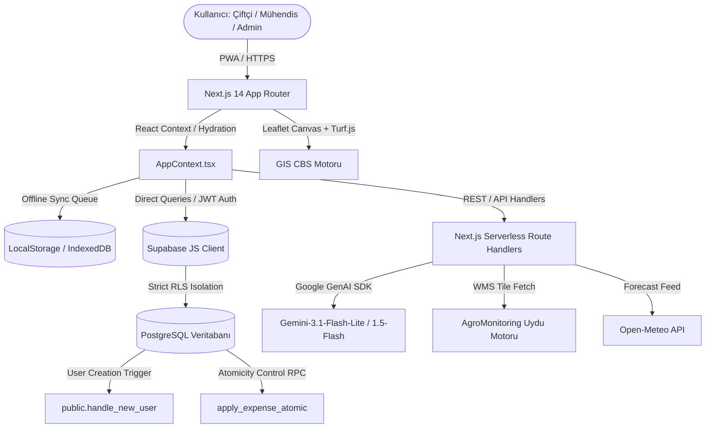

# ORJUT AGTECH OS — SİSTEM MİMARİSİ (SYSTEM ARCHITECTURE)

Bu doküman, Orjut'un katmanlı teknik mimarisini, veri akışını ve ana sistem bileşenlerinin teknik özelliklerini barındırır.

---

## 1. MİMARİ TOPOLOJİ

Sistem, istemci ve sunucu katmanları arasında veri senkronizasyonunu PWA ve Serverless yapı ile sağlayan bir "Hibrit SaaS" topolojisine sahiptir.

---

## 2. FRONTEND (İSTEMCİ) KATMANI

* **Next.js 14 App Router:** SSR (Server-Side Rendering) ve CSR (Client-Side Rendering) karma yeteneklerinden faydalanılır. Tüm sayfalar `app/` dizininde modüler tutulur.
* **Durum Yönetimi (State Management):** `AppContext.tsx` global React Context'i olarak işlev görür. Veritabanından gelen temel bilgiler (araziler, finansal işlemler, depolar vb.) ilk açılışta ("Hydration") paralel olarak Supabase'den çekilir ve cachelenir.
* **Offline-First PWA:** İnternet koptuğu zaman `sw.js` (Service Worker) önbelleğe alınmış harita ve dosyaları sunar. Yeni işlemler `localStorage` içerisinde `pending_` ön ekiyle kuyruğa alınır; internet gelince Supabase'e gönderilir.
* **Görsel Katman:** Tailwind CSS kullanılarak modern, cam efektli (Glassmorphism), "Dark Mode" öncelikli bir arayüz tasarlanmıştır.

---

## 3. BACKEND (SUNUCU) KATMANI

Next.js'in API Route Handlers yetenekleri (klasör içindeki `route.ts` dosyaları) sunucu olarak görev yapar. 
* **Serverless Mimari:** API istekleri anlık olarak ayağa kalkar, işlemi bitirir ve kapanır. 
* **Güvenlik (Validation):** İstemciden gelen veriler **Zod** kullanılarak parse edilir ve doğrulanır.
* **Yapay Zeka (AI) Adaptörü:** LLM istekleri doğrudan istemciye sunulmaz. Tüm Gemini API anahtarları `route.ts` dosyalarının içinde güvence altına alınmıştır. RAG motoru verileri bu sunucu katmanında küçülterek API'ye iletir.

---

## 4. CBS (COĞRAFİ BİLGİ SİSTEMLERİ) MOTORU

Orjut'un temel gücü tarla sınırlarını ve uydu görüntülerini işleyebilmesidir.
* **Harita Altlıkları:** Leaflet.js ve `react-leaflet` kullanılır. 
* **Çokgen (Poligon) Çizimi:** Çiftçi tarlasını `react-leaflet-draw` editörü ile çizer.
* **Matematiksel Hesaplamalar:** `@turf/turf` modülü ile istemci tarafında çokgenin kaç "Dekar" veya "Metrekare" olduğu anında hesaplanır. Sunucu limitlerini korumak için 500 dekar üzeri çizimler engellenir.
* **Coğrafi Formatlama:** Koordinat verileri veritabanına `GeoJSON` formatında yazılır.
* **Hata Giderme (Fallback):** Eğer uydu sisteminden (AgroMonitoring) NDVI sağlık katmanı yanıt vermezse, sistem bitkinin türü ve sulama senaryosuna göre deterministik bir renk simülasyon katmanı oluşturur.

---

## 5. KİMLİK DOĞRULAMA (AUTHENTICATION) VE YETKİLENDİRME (AUTHORIZATION)

* Supabase Auth kullanılarak Email/Şifre veya Telefon numarası üzerinden session token alınır.
* Kullanıcı oluşturulduğu anda Supabase tarafında PostgreSQL trigger `handle_new_user()` tetiklenerek kullanıcı verisi `public.profiles` tablosuna senkronize edilir.
* Her kullanıcının varsayılan olarak bir rolü (`farmer`) vardır.
* Tarayıcı seviyesinde `AuthGuard.tsx` izinsiz yetki yükseltme veya rotalara erişim teşebbüslerini (`/admin` gibi) durdurarak kullanıcıyı ana sayfaya yönlendirir.
